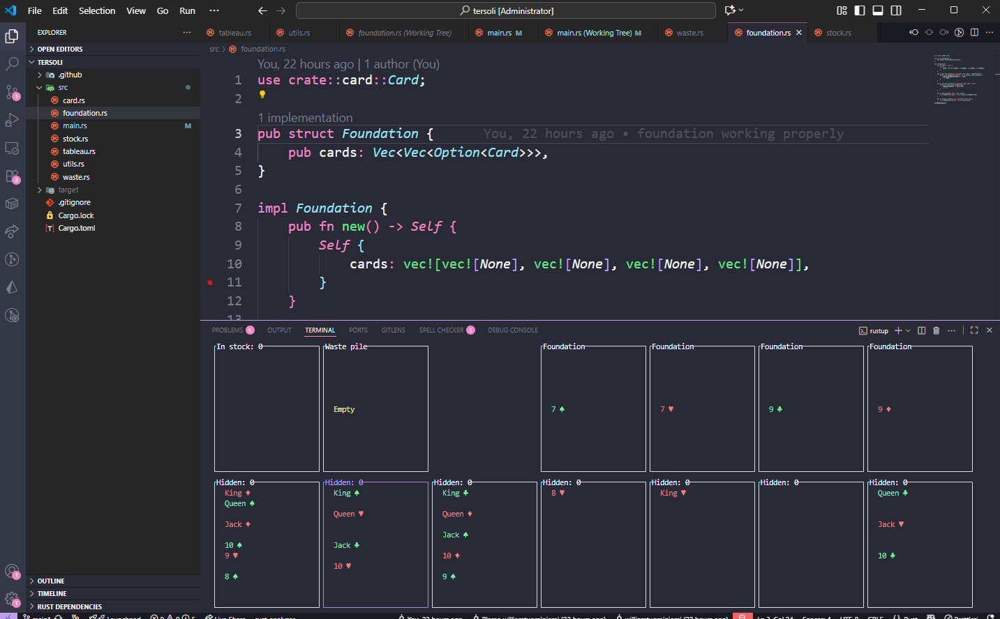

Do you want to play a game but look like you're working hard?

# Keybindings

- Navigate "cursor" around with **arrow keys** or **WASD**
- Select card with **ENTER** key
- Automatically place card in foundation with **SPACE**
- Quit game with **q** key

# How to play?

- Rules quite similar to klondike solitaire
- Move cards by activating them, then activating the position you want to move them to
- "Activate" on stock pile to get more cards to the waste pile

