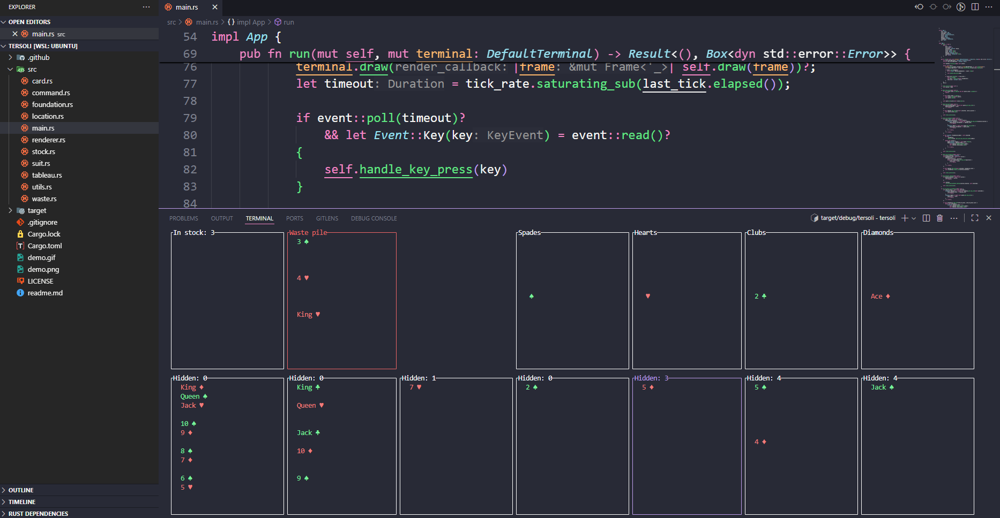

Do you want to play a game but look like you're working hard?

# Keybindings

- Navigate "cursor" around with **arrow keys** or **WASD**
- Select card with **ENTER** key
- Automatically place card in foundation with **SPACE**
- Quit game with **q** key

# How to play?

- Rules quite similar to klondike solitaire
- Move cards by activating them, then activating the position you want to move them to
- "Activate" on stock pile to get more cards to the waste pile

- Hidden means that there are non visible, unknown cards beneath the visible cards
- Waste pile always shows the last three cards drawn from stock

# Installation and usage

*Rust and Cargo are required to be installed*

Run ``cargo install --path .`` in this project root.

After this type **tersoli** into your terminal to launch the game whenever you want.

# Technical overview

- Used Ratatui terminal user interface library. 
- Unit tests for the most central logic and mechanics.